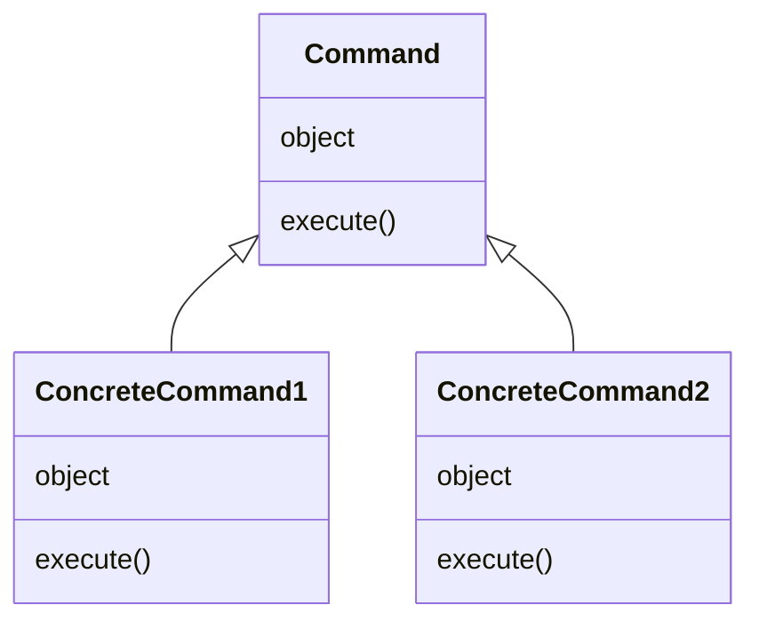

## 目次

1. 適用箇所
   1. 具体的なシチュエーション
   2. 解決すること
2. 構成図
3. command パターンの使った実装 1
   1. Proc とは
   2. 具体的な実装
4. command パターンの使った実装 2
   1. シチュエーション
   2. 具体的な実装
5. 注意点

## 適用箇所

命令を管理したいシチュエーションで使える

- 特定のタイミングで命令を実行したい
- 一度実行した命令を再実行したい
- 複数の命令を一括で実行したい
- 実行済みの命令の履歴を確認したい
- 実行済みの命令を取り消したい(ロールバック)

### 具体的なシチュエーション

- GUI 画面で保存ボタンをクリックした時に、保存命令を実行する。メニューボタンをクリックした時は、メニューを開く命令を実行する
- ソフトウェアのインストール時に、ディレクトリの作成、必要なファイルのインストール等の一連の命令群を実行する
- ワードやエクセル等で、データの追加や誤ってデータを削除してしまったりなど、すでに完了した命令群を取り消す

### 解決すること

命令を管理したいシチュエーションは膨大に存在する。シチュエーション毎にオブジェクトを作成してしまうと、オブジェクトの数が膨大になってしまう。かといってオブジェクトでないと手続き的な処理となり再利用性が低くなってしまう。命令をオブジェクトとして切り出すことで、実行タイミングと実行処理が分離され、命令を再利用しやすくするのが command パターンである

## 構成図

- Command は命令の実行に必要な要素(attribute)と処理(execute)を持つ



## command パターンを使った実装 1

command パターンの目的は、命令をオブジェクトにすることで実行タイミングと実行処理を分離することである。そのため、Ruby では Command オブジェクトを作成しなくとも Proc を使うことで同じことを実現できる

### Proc とは

Proc とは、ブロックをコンテキスト(ローカル変数のスコープやスタックフレーム)とともにオブジェクト化したもの。これにより、実行タイミングと実行処理を分離できる([参考文献](https://docs.ruby-lang.org/ja/2.7.0/class/Proc.html))<br>
ブロックとは制御構造(順次, 繰り返し, 分岐)の抽象化のために用いられる処理の塊(命令)。メソッドの引数として渡すことができ、単体で存在することはできない([参考文献](https://docs.ruby-lang.org/ja/latest/doc/spec=2fcall.html#block))<br>

```ruby
# ブロックなしの例
values = [6, 8, 10]
## 各要素を倍にした処理の結果を表示する
def double_values(values)
  double_values = []
  for element in values
    double_values << element * 2
  end
  double_values
end

## 各要素を半分にした処理の結果を表示する
def half_values(values)
  half_values = []
  for element in values
    half_values << element / 2
  end
  half_values
end

double_values(values) => [12, 16, 20]
half_values(values) => [3, 4, 5]

# ブロックありの例
values = [6, 8, 10]
## 各要素に対して特定の計算処理をした結果を表示する
def calculate_values(values)
  new_values = []
  for element in values
    # yieldでブロックを実行
    new_values << yield(element) if block_given?
  end
  new_values
end

calculate_values(values) { |element| element * 2 }
=> [12, 16, 20]
calculate_values(values) { |element| element / 2 }
=> [3, 4, 5]

# procを使った例
## 処理内容はわかっているが、どの要素を2倍して、どの配列に追加するのかの具体的な部文はまだわからない
add_double_element = Proc.new do |array, element|
  array << element * 2
end
add_half_element = Proc.new do |array, element|
  array << element / 2
end

values = [6, 8, 10]

def calculated_values(values, &block)
  new_values = []
  for element in values
    block.call(new_values, element)
  end
  new_values
end

calculated_values(values, &add_double_element)
=> [12, 16, 20]
calculated_values(values, &add_half_element)
=> [3, 4, 5]
```

### Proc で実装する
