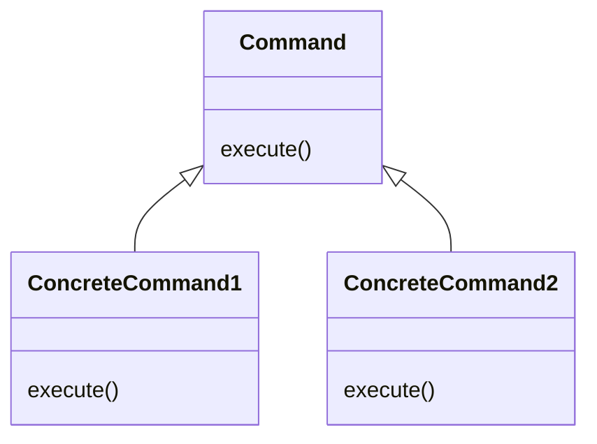

## 目次

1. 適用箇所
   1. 具体的なシチュエーション
   2. 解決すること
2. 構成図
3. command パターンを使わない実装
4. command パターンの使った実装 Proc
5. command パターンの使った実装 Command
6. 具体的な実装

## 適用箇所

命令を管理したい(命令の内容を先に定義しておいて、後で実装したい)シチュエーションで使える

- 特定のタイミングで命令を実行したい
- 選択肢に応じて複数の命令を一括で実行したい
- 実行済みの命令の履歴を確認したい
- 実行済みの命令を取り消したい(ロールバック)
- 一度実行した命令を再実行したい

### 具体的なシチュエーション

- GUI 画面で保存ボタンをクリックした時に、保存する。メニューボタンをクリックした時は、メニューを開く
- ソフトウェアのインストール時に、選択肢によってディレクトリの作成、必要なファイルのインストール等の一連の命令を実行する
- ワードやエクセル等で、データの追加や誤ってデータを削除してしまったりなど、すでに完了してしまった命令を取り消す

### 解決すること

命令を管理したいシチュエーションは多く存在する。シチュエーション毎にオブジェクトを作成してしまうと、オブジェクトの数が膨大になってしまう(実行タイミングは異なるが命令は同じ等)。命令の内容をオブジェクトとして切り出し、命令の内容と命令の実行を分離することで、再利用性を高めることが command パターンである

```ruby
# 命令の内容と実行が切り離されていない
File.open('sample.rb', 'r')

# 命令の内容と実行が切り離されている
obj = Proc.new { File.open('sample.rb', 'r') } # 命令の内容
obj.call # 命令の実行
```

## 構成図

- Command は命令の内容と命令の実行(execute)を持つ



## command パターンを使わない実装

命令を実行したい箇所に命令の内容が記述されている。どちらも命令を実行したいタイミングは、配列の各要素にアクセスするときのため共通化できそうである

```ruby
values = [6, 8, 10]
## 各要素を倍にした処理の結果を表示する
def double_values(values)
  double_values = []
  for element in values
    double_values << element * 2 # 命令を実行したい箇所に命令の内容が記述されている
  end
  double_values
end

## 各要素を半分にした処理の結果を表示する
def half_values(values)
  half_values = []
  for element in values
    half_values << element / 2 # 命令を実行したい箇所に命令の内容が記述されている
  end
  half_values
end

double_values(values) => [12, 16, 20]
half_values(values) => [3, 4, 5]
```

## command パターンを使った実装

Ruby では Command オブジェクトを作成しなくとも Proc を使うことで同じことを実現できる<br>

- Proc とは、ブロックをコンテキスト(ローカル変数のスコープやスタックフレーム)とともにオブジェクト化したもの。([参考文献](https://docs.ruby-lang.org/ja/2.7.0/class/Proc.html))<br>
- ブロックとは制御構造(順次, 繰り返し, 分岐)の抽象化のために用いられる処理の塊(命令)。メソッドの引数として渡すことができ、単体で存在することはできない([参考文献](https://docs.ruby-lang.org/ja/latest/doc/spec=2fcall.html#block))<br>

```ruby
# ブロックで実装する
values = [6, 8, 10]
## 各要素に対して特定の計算処理をした結果を表示する
def calculate_values(values)
  new_values = []
  for element in values
    # yieldでブロックを実行
    new_values << yield(element) if block_given?
  end
  new_values
end

calculate_values(values) { |element| element * 2 }
=> [12, 16, 20]
calculate_values(values) { |element| element / 2 }
=> [3, 4, 5]

# procを使った例
## 処理内容はわかっているが、どの要素を2倍して、どの配列に追加するのかの具体的な部文はまだわからない
add_double_element = Proc.new do |array, element|
  array << element * 2
end
add_half_element = Proc.new do |array, element|
  array << element / 2
end

values = [6, 8, 10]

def calculated_values(values, &block)
  new_values = []
  for element in values
    block.call(new_values, element)
  end
  new_values
end

calculated_values(values, &add_double_element)
=> [12, 16, 20]
calculated_values(values, &add_half_element)
=> [3, 4, 5]
```

## command パターンの使った実装 Command

Excel 等で実行したコマンドを暗記しておき、元に戻せるようにしたいケースで考える<br>
命令の内容が複雑だった(Proc で定義するには大きすぎる)り、複数の命令を保持したい場合は、command オブジェクトが役に立つ

### 1. 抽象クラス command を作成する

```ruby
class Command
  def execute
    raise NotImplementedError
  end

  def unexecute
    raise NotImplementedError
  end
end

class CreateSheet < Command
  def initialize(path)
    @path = path
    @contents = contents
  end

  def execute
    file = File.open(@path, 'w')
    file.write(@contents)
    file.close
  end

  # 巻き戻し処理
  def unexecute
    File.delete(@path)
  end
end

class DeleteSheet < Command
  def initialize(path)
    @path = path
  end

  def execute
    @contents = File.read(@path)
    File.delete(@path)
  end

  # 巻き戻し処理
  def unexecute
    return unless @contents

    file = File.open(@path, 'w')
    file.write(@contents)
    file.close
  end
end
```

### 2. 命令の実行履歴がわかるように command のコレクションを作成する

```ruby
class CommandCollection
  def initialize
    @commands = []
  end

  def add_command(command)
    @commands << command
  end

  def execute
    @commands.each { |cmd| cmd.execute }
  end

  def unexecute
    @commands.reverse.each { |cmd| cmd.unexecute }
  end
end

command_collection = CommandCollection.new
command_collection.add_command(CreateSheet.new('sample1.text'))
command_collection.add_command(DeleteSheet.new('sample2.text'))
# コピー実行処理
command_collection.execute
# コピー巻き戻し処理
command_collection.unexecute
```

## 具体的な実装

### ruby で command が使われているケース

Lrama という構文解析をする module で定義されていた。
https://github.com/ruby/ruby/blob/master/tool/lrama/lib/lrama/command.rb

### bkk での実装

例えば kensakukun から部屋を取得する処理は、検索パラメータの作成(Kensakukun::V3::Query)と、検索の実行(Kensakukun::RentRoomBuildingCollection)はオブジェクトを分離している。これも Command パターンの一種であると考えられる。

```ruby
module Kensakukun
  class RentRoomBuildingCollection
    def search_motoduke_rent_rooms(params, connect_account_ids)
      query = Kensakukun::V3::Query.build_for_motoduke_rent_rooms(
        params[:filter], params[:page], connect_account_ids
      )
      search_and_build(query) # 検索の実行
    end

    private

    def search_and_build(query)
      response = Kensakukun::Client.search_properties(query.convert_to_h)

      ...
    end
  end
end
```
