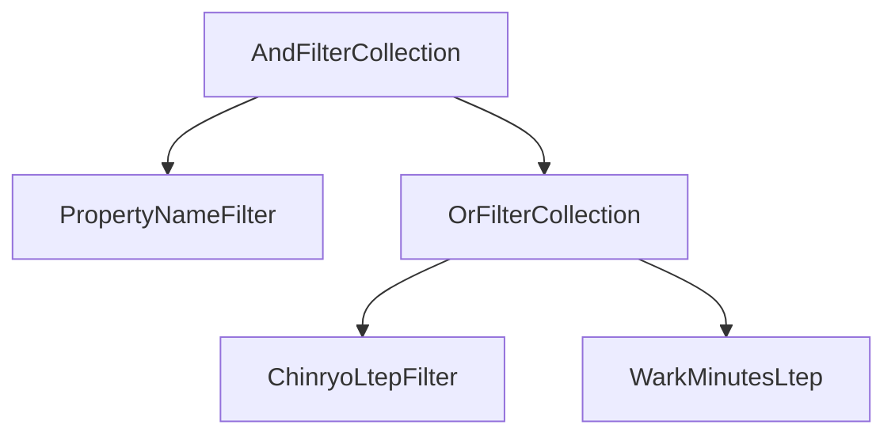

# Interpreter パターン

## 目次

1. 適用箇所
   1. 具体的なシチュエーション
   2. 解決すること
2. 専門用語を解釈する方法
   1. 字句解析
   2. 構文解析
3. 構成図
4. 実装シチュエーション
5. パターンを使わない実装
   1. front から渡される URL クエリパラメータ
   2. 実装
   3. メリット・デメリット
6. パターンを使った実装
   1. front から渡される URL クエリパラメータ
   2. AST の雛形を作る
   3. parser を作る
   4. メリット・デメリット
7. 具体的に使われている箇所
   1. GitHub の AdvancedSearch
   2. bb での実装
8. その他

## 適用箇所

ある用途に特化した専用言語を作ることで、直感的にその用途を達成できるようにしたいとき<br>
ex. プログラミング言語は、コンピュータに命令することを用途としており、機械語で命令するのではなく、自然言語のような専門言語を通じて、直感的に命令を与えるようにしている

### 具体的なシチュエーション

組み合わせが膨大に存在し、動的に組み合わせを変更する用途。組み合わせが増える度にコードが複雑になりやすいため

- 検索機能
  - 検索条件の組み合わせ
- コマンドライン
  - 複数の option の組み合わせ
- データベースへのアクセス
  - どのようなデータを取得するかの組み合わせ

### 解決すること

用途に特化した専門用語を提供し、その専門用語を解釈し実行することで、直感的で柔軟な(抽象的な)コードにする<br>
ex. 専門用語を介することで、柔軟なコードになる場合がある。C 言語はソースコードを直接機械語に変換し CPU が実行するため、ソースコードに具体性が求められる(受け取るデータの型と byte 数を定義しないといけない)。Ruby はソースコードをバイトコード(RubyVM が解釈できる専門用語)に変換し、RubyVM が実行するため、ソースコードが C 言語と比較して抽象的で済む。

## 専門用語を解釈する方法

字句解析 → 構文解析すること。この処理を Parser と呼ぶ。以下の gem でこの処理を視覚可することができる<br>
https://github.com/pocke/rpr

### 字句解析

与えられた用語を意味のある単位(token)に分解すること。基本的に正規表現を使って分解する。

**ruby コード**

```ruby
5.0 + 4.0
```

**字句解析の結果**

```terminal
rpr gof_design_patterns/interpreter/sum.rb -p tokenize
["5.0", " ", "+", " ", "4.0"]
```

### 構文解析

字句解析の結果から、抽象構文木(AST)を作成すること。AST は、終端文字と非終端文字で構成され、token からどちらの文字か判断し、ツリー形状の構造を生成する(用語の正当性を検証しやすくするため)<br>

- 終端文字
  - ツリーの末端。単体で存在できるもの
- 非終端文字
  - ツリーの枝分かれ。単体で存在せず、子の要素を持つ者(親子関係を作る)
  - Composite パターン

**ruby コード**

```ruby
5.0 + 4.0
```

**構文解析の結果**<br>
`+`を非終端文字のメソッド呼び出し(send)として解釈している。`5.0.+(4.0)`として解釈される。

```terminal
rpr gof_design_patterns/interpreter/sum.rb -f dot | dot -Tpng -oast.png
```

[](https://gyazo.com/950500409a419135ee8134dffc924991)

## 構成図

- Context が専門用語を表す
- Expression 周りが AST を表す(Composite パターンになっている)
- Interpret が解釈した処理の実行を示す

[](https://gyazo.com/1b591f4b1a86f35084123ade2ae62fff)

[参考文献](https://qiita.com/Nuits/items/5a0daad3d16f4767b3e0)

## 実装シチュエーション

front から 何かしらの URL クエリパラメータで物件名と賃料の値が渡され、その値を専用の Hash パラメータに変換し、API にリクエストすることで物件を検索するシチュエーションで考える<br>

#### 専用の Hash パラメータ

```json
// AND検索
{ "filter" => [
    { "propertyName:in" => "test" },
    { "chinryo:ltep" => "500000" },
    { "chinryo:gtep" => "0" },
  ],
  "operator" => "and"
}
// OR検索
{ "filter" => [
    { "propertyName:In" => "test" },
    { "chinryo:ltep" => "500000" },
    { "chinryo:gtep" => "0" },
  ]
  "operator" => "or"
}
```

#### API にリクエストする

```ruby
filters =
  { "filter" => [
      { "propertyName:in" => "test" },
      { "chinryo:ltep" => "500000" },
      { "chinryo:gtep" => "0" },
    ],
    "operator" => "and"
  }
Kensakukun.search(filters)
```

## パターンを使わない実装

### front から渡される URL クエリパラメータ

`?property_name=test&chinryo=500000`

### 専用の Hash パラメータに変換する実装

```ruby
# 名称と賃料で物件を検索するクラス
class PropertyFilter
  class << self
    def build_property_name_and_chinryo(params)
      filters = [
        property_name_filter(params[:property_name]),
        chinryo_ltep_filter(params[:chinryo])
      ]

      { filter: filters,  operator: "and" }
    end

    private

    def property_name_filter(property_name)
      { "propertyName:in" => property_name }
    end

    def chinryo_ltep_filter(chinryo)
      { "chinryo:ltep" => chinryo }
    end
  end
end

params = { property_name: 'test', chinryo: 500000 }
filters = PropertyFilter.build_property_name_and_chinryo(params)
Kensakukun.search(filters.convert_to_h)
```

### メリット・デメリット

#### メリット

- URL クエリパラメータの key と filter が 1 対 1 で対応付けられているため、実装がシンプル

#### デメリット

- 検索対象と条件が増えるたびに、PropertyFilter のメソッドと URL クエリパラメータが増える
- 物件名が test and ( 賃料が 5 万円以下 or 駅徒歩 5 分以内 )のような複雑な検索の実装が難しい

## パターンを使った実装

### front から渡される URL クエリパラメータ

`?q="and (property_name:test) (or (chinryo_ltep:500000) (wark_minutes_ltep:0))"`

### AST の雛形を作る

**終端文字クラスの作成**

```ruby
class FilterBase
  def initialize(field, matcher, values)
    @field = field
    @matcher = matcher
    @values = values
  end

  def convert_to_h
    { "#{field}:#{matcher}": values }
  end

  private

  attr_reader :field
  attr_reader :matcher
  attr_reader :values
end

class PropertyNameFilter < FilterBase
  FIELD = 'propertyName'
  private_constant :FIELD

  MATCHER = 'in'
  private_constant :MATCHER

  class << self
    def build(property_name)
      new(
        FIELD,
        MATCHER,
        property_name
      )
    end
  end
end

class ChinryoLtepFilter < FilterBase
  FIELD = 'chinryo'
  private_constant :FIELD

  MATCHER = 'ltep'
  private_constant :MATCHER

  class << self
    def build(amount)
      new(
        FIELD,
        MATCHER,
        amount
      )
    end
  end
end

class WarkMinutesLtep < FilterBase
  FIELD = 'wark_minutes'
  private_constant :FIELD

  MATCHER = 'ltep'
  private_constant :MATCHER

  class << self
    def build(minutes)
      new(
        FIELD,
        MATCHER,
        minutes
      )
    end
  end
end
```

**非終端文字クラスの作成**

```ruby
class FilterCollectionBase
  class << self
    def self.operator
      raise NotImplementedError, "#{self.name} must implement the .operator class method"
    end
  end

  def initialize(expression1, expression2) # 可変長を引数にして実装できそうな気がするな気がする
    @expression1 = expression1
    @expression2 = expression2
  end

  def convert_to_h
    {
      filter: [expression1, expression2].map(&:convert_to_h),
      operator: self.class.operator
    }
  end

  private

  attr_reader :expression1, :expression2
end

class AndFilterCollection < FilterCollectionBase
  OPERATOR = 'and'

  class << self
    def operator
      OPERATOR
    end
  end
end

class OrFilterCollection < FilterCollectionBase
  OPERATOR = 'or'

  class << self
    def operator
      OPERATOR
    end
  end
end
```

### parser を作る

**parser の実装**

```ruby
class Parser
  def initialize(text)
    @tokens = text.scan(/\(|\)|\w+/)
  end

  def puts_tokens
    tokens
  end

  def next_token
    tokens.shift
  end

  def expression
    token = next_token

    case token
    when nil
      nil
    when '('
      result = expression
      raise 'Expected )' if next_token != ')'
      result
    when 'property_name'
      PropertyNameFilter.build(next_token.to_s)
    when 'chinryo_ltep'
      ChinryoLtepFilter.build(next_token.to_i)
    when 'wark_minutes_ltep'
      WarkMinutesLtep.build(next_token.to_i)
    when 'and' # 可変長を引数にして実装できそうな気がする
      AndFilterCollection.new(expression, expression)
    when 'or' # 可変長を引数にして実装できそうな気がする
      OrFilterCollection.new(expression, expression)
    else
      raise "Unexpected token: #{token}"
    end
  end

  private

  attr_reader :tokens
end

params = { q: "and (property_name=test) (or (chinryo_ltep=500000) (wark_minutes_ltep=0))" }
filters = Parser.new(params[:q]).expression
Kensakukun.search(filters.convert_to_h)
```

**parser の結果を AST で図示する**

```terminal
pry(main)> filters.convert_to_h
=> {:filter=>[{:"propertyName:in"=>"test"}, {:filter=>[{:"chinryo:ltep"=>500000}, {:"wark_minutes:ltep"=>0}], :operator=>"or"}], :operator=>"and"}
```



### メリット・デメリット

#### メリット

- 物件名が test or ( 賃料が 5 万円以下 and 駅徒歩 5 分以内 )のような複雑な検索に対応できる
- クエリパラメータを見て、どういった条件で検索をしているかがわかりやすい

#### デメリット

- AST や parser を作る必要があり、実装コストがかかる

## 具体的に使われている箇所

### GitHub の AdvancedSearch

以下のような専用言語を使うことで、リポジトリやコードを検索することができる<br>

```ruby
# rubyという文字がreadmeもしくはdescriptionに含まれているかつ、starが5000以上のリポジトリを検索
ruby in:readme,description stars:>5000
# URLクエリパラメータ
https://github.com/search?q=ruby in:readme,description,name stars:>5000&type=repositories
```

#### 実装の詳細

https://docs.github.com/ja/search-github/getting-started-with-searching-on-github/understanding-the-search-syntax

### bb での実装

bb では front の URL パラメータの key に検索対象と条件を含め、backend 側で split し、必要なオブジェクトを生成している。OR 検索ができるようになった時には、ツリー状のオブジェクトが生成されることになり、Interpreter パターンを使うことになりそう。

```ruby
params = [
  { 'property.type:eq' => 'land' },
  { 'property.dealType:eq' => 'sale' }
]

def build_params(params)
  params.map do |key, value|
    search_key, matcher = key.to_s.split(':')
    build_filter_class(search_key).build(value, matcher)
  end
end
```

[参考文献](https://github.com/itandi/itandi_bb_backend/blob/f435863e2cd0f0b7596a6be486581be30fc6b95e/app/services/kensakukun/filter/collection.rb#L789)

## その他

外部 DSL、内部 DSL がある。Ruby では eval というメソッドが提供されており、これを使って内部 DSL を簡単に作ることができる。
https://docs.ruby-lang.org/ja/latest/method/Kernel/m/eval.html
