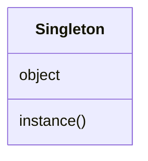

# singleton パターン

## 目次

1. 適用箇所
   1. 具体的なシチュエーション
   2. 解決すること
2. 構成図
3. パターンを使わない実装
4. パターンを使った実装
5. パターンを使ったことで起きる副作用
   1. 単体テストがしにくくなる
   2. 密結合を作りやすい環境を提供してしまう
6. 副作用に対する改善策
   1. 単体テストがしにくくなる
   2. 密結合を作りやすい環境を提供してしまう
7. 具体的な実装について
   1. ruby で singleton が使われているケース
   2. bkk での実装

## 適用箇所

あるクラスのインスタンスが 1 つしかないことを保証したいかつ、そのインスタンスを複数箇所から参照したい場合に使える

### 具体的なシチュエーション

\*実際に singleton が使われているシチュエーションではなく、singleton パターンを使うことを検討できるシチュエーション

- アプリケーション全体の設定情報や環境設定にアクセスするとき
- ログの出力するとき
- DB へアクセスするとき
- キャッシュへアクセスするとき

### 解決すること

ログはアプリケーションで共通に扱われるため、常に 1 つのインスタンスであることが望ましい。インスタンスが複数作成されるこで、上書きされたりしてしまうと問題だからである。singleton を適用することで、インスタンスが 1 つであることを保証し、同一のインスタンスを取得するためのグローバルなアクセスポイントを提供する

## 構成図

- Singleton はそのクラスでただ 1 つのインスタンスを要素に持ち、そのインスタンスにアクセスする instance()とうグローバルアクセスを提供する



## singleton パターンを使わない実装

ログ出力するためのクラスを作成した。この状態では Logger インスタンスが複数作成できてしまい、意図していなかった状態のインスタンスに対してメソッドを呼び出してしまう危険性がある。

```ruby
class Logger
  attr_accessor :level

  ERROR = 1
  WARNING = 2
  INFO = 3

  def initialize
    @log = File.open("log.txt", "w")
    @level = WARNING
  end

  def error(msg)
    @log.puts(msg)
    @log.flush
  end

  def warning(msg)
    @log.puts(msg) if @level >= WARNING
    @log.flush
  end

  def info(msg)
    @log.puts(msg) if @level >= INFO
    @log.flush
  end
end

logger = Logger.new
logger.level = Logger::INFO
logger = Logger.new
# infoを表示したかったが、Loggerが再定義されwarningとなってしまい表示されない
logger.info('1つ目の処理を実行')
 => 出力されず
```

## singleton パターンを使った実装

以下のようにして、singleton を実装する。

1. クラス変数に自身のインスタンスを格納し、外部から初期化されないように new を private 化する => インスタンスを複数作成されないようにするため
2. クラスメソッドとしてインスタンスにアクセスする手段を提供する => グローバルなアクセスを提供するため

```ruby
class Logger
  attr_accessor :level

  ERROR = 1
  WARNING = 2
  INFO = 3

  def initialize
    @log = File.open("log.txt", "w")
    @level = WARNING
  end

  def self.instance
    @@instance ||= new
  end

  def error(msg)
    @log.puts(msg)
    @log.flush
  end

  def warning(msg)
    @log.puts(msg) if @level >= WARNING
    @log.flush
  end

  def info(msg)
    @log.puts(msg) if @level >= INFO
    @log.flush
  end

  private_class_method :new
end

logger = Logger.instance
logger.level = Logger::INFO
logger = Logger.instance
logger.info('1つ目の処理を実行')
 => '1つ目の処理を実行'
```

## パターンを使ったことで起きる副作用

### 単体テストがしにくくなる

アプリケーションの設定を管理するオブジェクトを作成した。この実装に対するテストを作成したが、テストの順番によってテストが落ちたり通ったりしてしまう。前のテストケースの状態を保持しており、よくないテストであると言える<br>

**実装**

```ruby
require 'singleton'

class Config
  include Singleton

  def initialize
    @settings = {}
  end

  def set(key, value)
    @settings[key] = value
  end

  def get(key)
    @settings[key]
  end
end

config = Config.instance
config.set('foo', 'Foo')
```

**テスト**

```ruby
require 'minitest/autorun'
require 'minitest/spec'
require_relative 'singleton_test'

describe 'Config get' do
  let(:config) { Config.instance }

  it 'when not found key' do
    puts 'テスト1実行'
    _(config.get('foo')).must_be_nil
  end

  it 'when found key' do
    puts 'テスト2実行'
    config.set('foo', 'Foo')
    _(config.get('foo')).must_equal 'Foo'
  end
end
```

### 密結合を作りやすい環境を提供してしまう

Mailer クラスで、アプリケーションの設定情報に応じて、メールを送るかどうかの処理を追加した。これにより Mailer クラスが Singleton クラスの実装と密結合してしまい、前途の同じようにテストがしにくくなる

```ruby
class Mailer
  def send_email
    # クラスメソッドというグローバルアクセスが密結合を作りやすくしている
    if Config.instance.get('debug') == true
      # デバックモードで実行
    else
      # メールを送信
      mailer.send_email!
    end
  end
end
```

## 副作用に対する改善策

### 単体テストがしにくくなる

Config クラスと singleton なクラスの 2 つのクラスを作成し、Config のみテストするようにする。

```ruby
class Config
  def initialize
    @store = {}
  end

  def set(key, value)
    @store[key] = value
  end

  def get(key)
    @store[key]
  end
end

class SingletonConfig < Config
  include Singleton
end
```

テストケース毎にインスタンスを初期化する

```ruby
require 'minitest/autorun'
require 'minitest/spec'
require_relative 'singleton_test'

describe 'Config get' do
  let(:config) { Config.instance }

  before do
    Config.instance_variable_set(:@_instance, nil)
  end

  it 'when not found key' do
    puts 'テスト1実行'
    _(config.get('foo')).must_be_nil
  end

  it 'when found key' do
    puts 'テスト2実行'
    config.set('foo', 'Foo')
    _(config.get('foo')).must_equal 'Foo'
  end
end
```

### 密結合を作りやすい環境を提供してしまう

singleton クラスを引数から渡すこと(依存性の注入)で Mailer と Config の依存度を低下させる

```ruby
class Mailer
  def initialize(config)
    @config = config # テストではconfigをsingletonでないオブジェクトでmockする
  end

  def send_email
    if @config.get('debug') == true
      # デバックモードで実行
    else
      # メールを送信
      mailer.send_email!
    end
  end
end

Mailer.new(Config.instance)
```

## 具体的な実装について

### ruby で singleton が使われているケース

singleton パターンが使われている例は以外に少ない。[rake/late_time](https://github.com/ruby/rake/blob/523931170f7a2a8271aac9761287e505e6a9a32c/lib/rake/late_time.rb#L2)で使われている。<br>
このように状態を持たない(attribute を持たない)クラスは、singleton にしてもテストのやりにくさと関係なく、かつ不要なオブジェクトを作成しないことでメモリの節約ができる。<br>
その他のクラスで利用されないのは、1. メリットよりもデメリットの方が大きい、2. singleton が必要なケースが意外に少ないことが理由だと思う。

### bkk での実装

bkk で singleton パターンの適用箇所は見つけられなかった。singleton の要素の 1 つである「そのインスタンスを複数箇所から参照したい場合」のケースだと、依存性の注入によって解決していた。<br>
例えば、bkk では account の情報に頻繁にアクセスする。application に account を取得する処理があり、取得したアカウントを依存性の注入によって、他のクラスに伝播している。

```ruby
class Application
  def current_account
    Account.find_by(itandi_account_id: session[:itandi_account_id])
  end
end

class RentRoomsController < Application
  def create
    RentRoomForm.new(
      rent_room: rent_room,
      account: current_account
      ...
    )
  end
end
```
